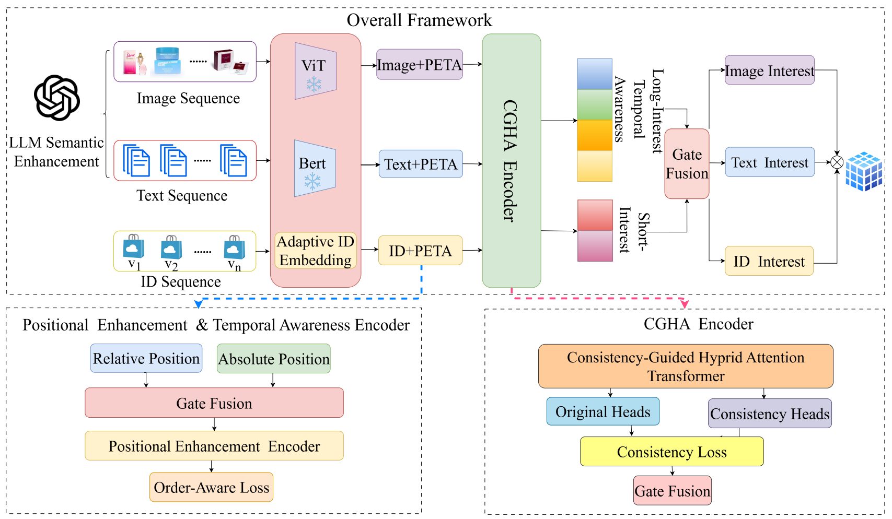

# LMM-Enhanced Multimodal Sequential Recommendation using Consistency-Guided Hybrid Attention

This repository contains the official implementation of the paper:
**"LMM-Enhanced Multimodal Sequential Recommendation using Consistency-Guided Hybrid Attention"**, submitted to **ICASSP, 2026**.



## 👉 Requirements

* Python 3.7+
* PyTorch 1.12+
* CUDA 11.6+
* Install transformers:
  * `pip install transformers`
* Install RecBole:
  * `pip install recbole`

## 🗂️ Dataset

This paper utilizes the following datasets:

**Amazon Dataset**: 🔗 [Amazon Reviews 2023](https://amazon-reviews-2023.github.io/#grouped-by-category)

- 📥 Download the raw files and place them in `preprocessing/origin_data/`.
- ▶️ Run the preprocessing scripts in order to generate the processed dataset.

💡 Example command sequence:

```bash
python preprocessing/1-process_data.py
python preprocessing/2-download_images.py
python preprocessing/3-data_convert.py
python preprocessing/4-image_summary.py
python preprocessing/5-join_text.py
python preprocessing/6-embedding_data.py
```

- 📤 Copy the resulting files from `preprocessing/processed/` to `dataset/`.

## ▶️ Run

```bash
python run_LEMSR.py
```


## 📌 Citation


## 🙏 Acknowledgment

This project is based on  [RecBole](https://github.com/RUCAIBox/RecBole) and [MLLM-MSR](https://github.com/YuyangYe/MLLM-MSR).  Thanks for their excellent works.


